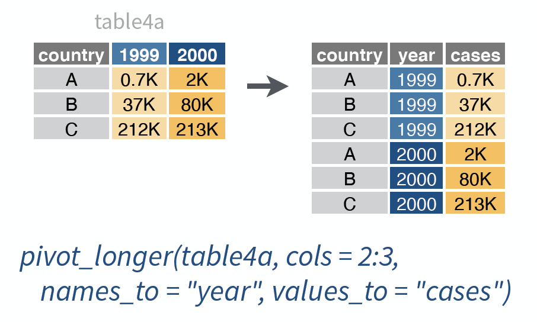
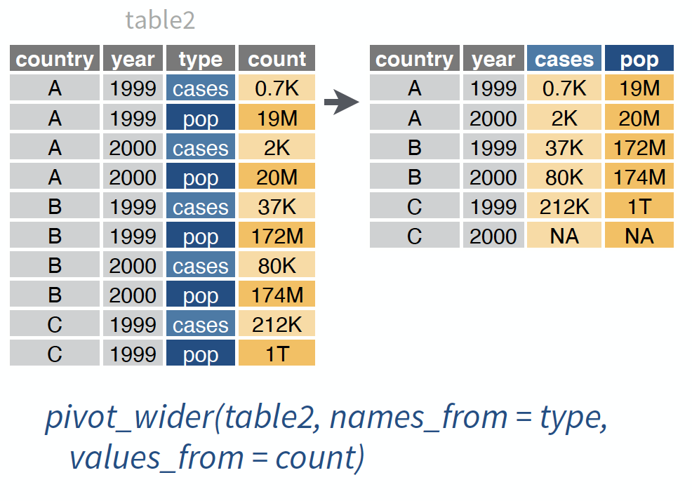
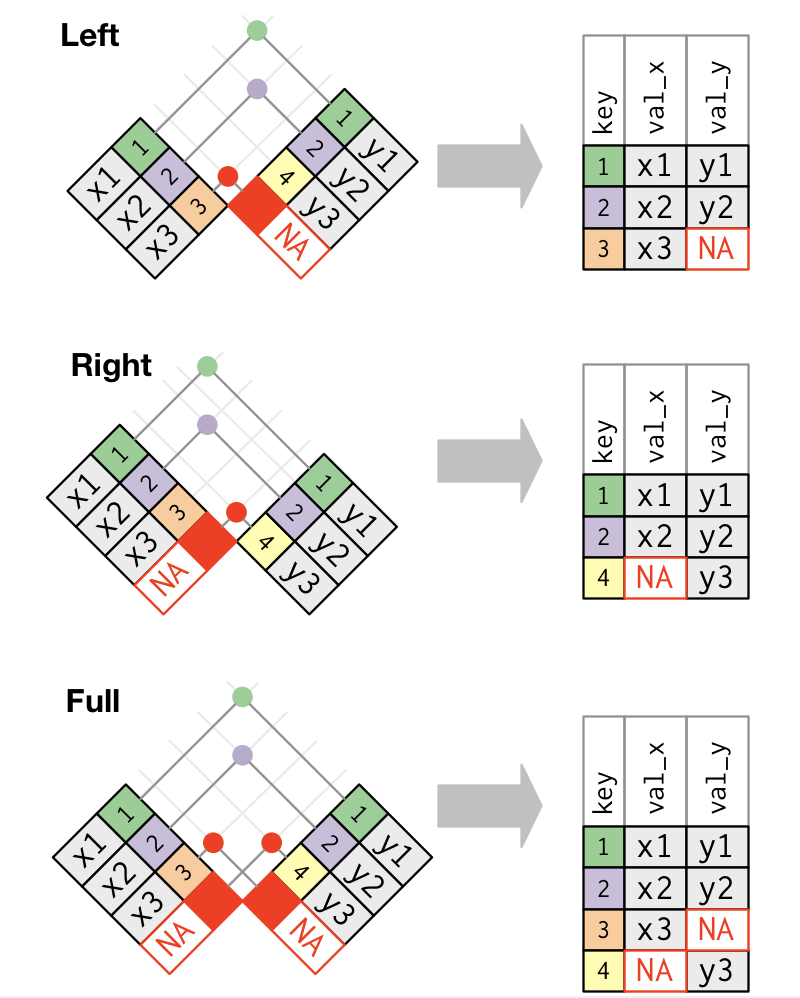

```{r setup, include=FALSE}
library(tidyverse)
```

```{css, echo=FALSE}
.small-output .remark-code{
  font-size: x-small;
}
```

# The big picture 

Components of a `ggplot`: 

- "tidy" data, with observations in rows, attributes in columns
- mapping of attributes to aesthetics (x, y, size, shape, color, transparency, etc)
- geometric objects (`geom`s)

This week: "data wrangling" to prepare data for plotting (and analysis).


---


# Structure of "tidy" data

Each observation has a row, each attribute has a column.

--

Definition of "observation" may depend on application. 


---

## "Wide" version of some V-Dem data 

```{css, echo=FALSE}
pre {
  white-space: pre-wrap;
  font-size: 80%
}
.remark-code {
  font-size: 80%;
}
```


```{r echo = F, message = F}
vdw <- read_csv("~/Dropbox/teaching/chicago/methods_sequence/IntroQSS/data/vdem_extract_wide.csv")
vdw
```

Here the "observation" is the country, and attributes are e.g. polyarchy in a year. 

--

Usually we prefer the observation to be the "country-year". Why?   


???

This is not how the `vdem` data really looks, but you do encounter datasets like this, e.g. the county presidential election data!

Reasons to prefer "country-year":

- some data we might want to add would be country-year (other data wouldn't)
- we might like to look at attributes over time and this format doesn't allow that

---

## Let's reshape/pivot! 

In `tidyverse` (`tidyr`): 

- `pivot_longer()` makes "wide" datasets longer
- `pivot_wider()` makes "long" datasets wider

What do we need here? 

```{r}
vdw
```


???

We need to make this wide dataset longer

---


## `pivot_longer()`



???

Source: [RStudio cheatsheet for tidyr](https://www.rstudio.com/resources/cheatsheets/)

---

## Applying `pivot_longer()`

```{r}
vdw %>% 
  pivot_longer(cols = polyarchy_1980:gdppc_2015,
               names_to = "name", values_to = "value")
``` 

Hmm, that's a bit **too** long!

--

Also, we want a `year` column.

---

## `separate()`

```{r}
vdw %>% 
  pivot_longer(cols = polyarchy_1980:gdppc_2015,
               names_to = "name", values_to = "value") %>% 
  separate(name, into = c("variable", "year"))   #<<
``` 


---

Same in a single step:
```{r}
vdw %>% 
  pivot_longer(cols = polyarchy_1980:gdppc_2015,
               names_to = c("variable", "year"), #<< 
               names_sep = "_", #<<
               values_to = "value")
``` 

Now we're ready to make columns for `polyarchy` and `gdpppc` via `pivot_wider()`! 

---


## `pivot_wider()`



???

Source: [RStudio cheatsheet for tidyr](https://www.rstudio.com/resources/cheatsheets/)

---

## Applying `pivot_wider()`

```{r}
tidy_vd <- vdw %>% 
  pivot_longer(cols = polyarchy_1980:gdppc_2015,
               names_to = c("variable", "year"),
               names_sep = "_", 
               values_to = "value") %>% 
  pivot_wider(names_from = variable, values_from = "value") #<<
tidy_vd
``` 

Mission accomplished! 

---

## Merging datasets 

Suppose we want to analyze by continent. No continent labels: 

```{r}
tidy_vd
```

---


But from [this url](https://datahub.io/JohnSnowLabs/country-and-continent-codes-list/r/country-and-continent-codes-list-csv.csv) we can download this dataset (also in course repo):

```{r, echo = F, message = F, warning = F}
codes <- read_csv("./../data/country-and-continent-codes-list-csv.csv")
```

```{r}
codes
```

---


The key columns: 


```{r}
codes %>% 
  select(Three_Letter_Country_Code, Country_Name, Continent_Name)
```

---


Compare:

```{r}
tidy_vd %>% 
  select(country_name, country_text_id, year, polyarchy, gdppc)
```

We want to merge `codes` into `tidy_vd`: wherever `country_text_id` in `tidy_vd` matches `Three_Letter_Country_Code` in `codes`, we want to add the `Continent_Name` from `codes`.    

---

## `left_join()` 

```{r}
tidy_vd %>% 
  left_join(codes, by = c("country_text_id" = "Three_Letter_Country_Code"))
```

---

## Different kinds of `join`s:

.pull-left[
```{r eval=F}
x %>% left_join(y, by = "key")
```

<br></br>

```{r eval=F}
x %>% right_join(y, by = "key")
```

<br></br>

```{r eval=F}
x %>% full_join(y, by = "key")
```
]

.pull-right[
```{r, echo = F, out.width="100%", fig.align="center"}

```
]

???

See also `inner_join()`.

Image source: [R4DS, "Relational data"](https://r4ds.had.co.nz/relational-data.html#relational-data)

---

```{r, message = F, warning = F, fig.height = 5.5, fig.width = 10.5}
vdw %>% 
  pivot_longer(cols = polyarchy_1980:gdppc_2015,
               names_to = c("variable", "year"), names_sep = "_", 
               values_to = "value") %>% 
  pivot_wider(names_from = variable, values_from = "value") %>%
  left_join(codes, by = c("country_text_id" = "Three_Letter_Country_Code")) %>% 
  filter(!is.na(Continent_Name)) %>% 
  group_by(year, Continent_Name) %>% 
  summarize(mean_polyarchy = mean(polyarchy, na.rm = T)) %>%
  ggplot(aes(x = year, y = mean_polyarchy, col = Continent_Name, group = Continent_Name)) + 
  geom_point() + 
  geom_line()
  
```


