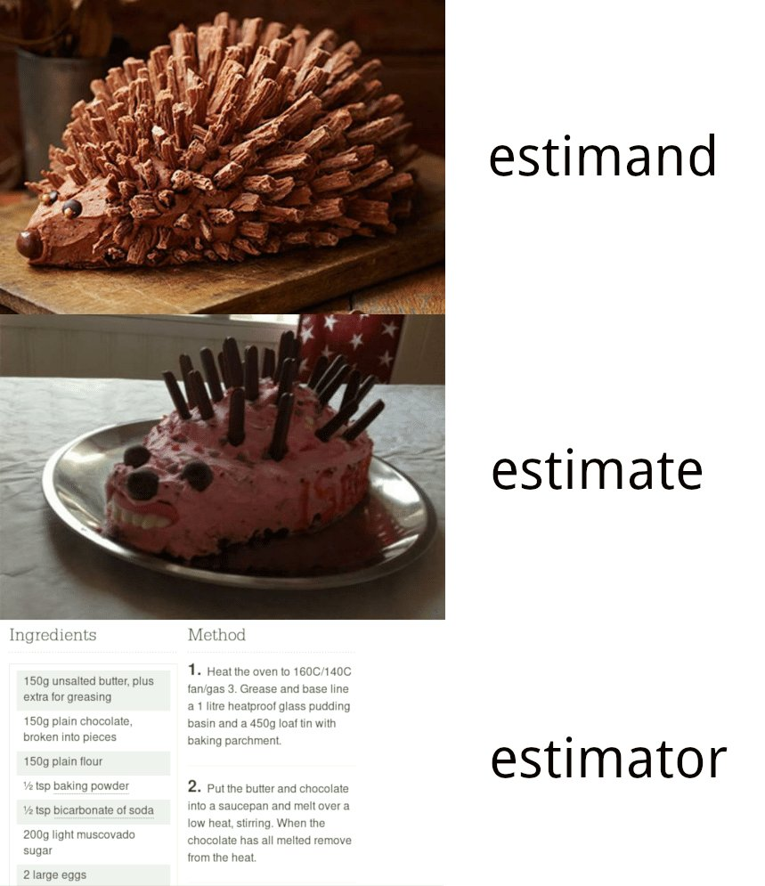

exclude: true
# Estimation

---


```{r setup, include=FALSE}
library(tidyverse)
library(ggdag)
set.seed(60637)
```

```{css, echo=FALSE}
.small-output .remark-code{
  font-size: small;
}

.white { color: white; }

# .show-only-last-code-result pre + pre:not(:last-of-type) code[class="remark-code"] {
#     display: none;
# }
```

On Tuesday, we considered *causal effects*, comparing individual response under treatment $D_i= 1$ vs. $D_i  = 0$.

--

$$\tau_i = \mathrm{ITE}_i = Y_i(1) - Y_i(0)$$
--
The fundamental problem of causal inference says we never see $\tau_i$. 

--

So instead, we might compare responses across people. 

---

## Average Treatment Effect (Average causal effect)

--

- Define a population of interest. 

--
- Define treatment comparison. 

--
- Define outcomes. 

--

Target: ATE 

$$
\begin{align*}
\textrm{E}[\tau_i] & = \textrm{E}[Y_i(1) - Y_i(0)]\\
& = \textrm{E}[Y_i(1)] - \textrm{E}[Y_i(0)]
\end{align*}
$$

???
Linearity of expectations


---
## Estimand

The *estimand* is the parameter of interest--it is the quantity that we would like to know about.

--

For example, when we care about causal effects, the estimand may be:

 - the Average Treatment Effect (ATE)
 - the Average effect of Treatment on the Treated (ATT)
 - the Average effect of Treatment on the Control (ATC)

--

Why might these three quantities differ?

--

*Notational aside: we often denote the estimand with the greek letter $\theta$. Specific estimands may have conventional notations, such as $\tau$ for the ATE, $\mu$ for the mean, or $\sigma$ for the standard deviation.*


---

(Augmented) Gerber Green example:

--
 - Population: 7 villages
 
--
- Treatment: $D= 1$ if female-headed council, $D=0$ if male
 
--
- Outcome: Budget allocation to sanitation

--

|           | $Y_i(0)$ | $Y_i(1)$ | $\tau_i$ |
|-----------|:--------:|:--------:|:--------:|
| Village 1 |    10    |    15    |     5    |
| Village 2 |    15    |     20   |     5    |
| Village 3 |    20    |     25   |     5    |
| Village 4 |    20    |     15   |     -5   |
| Village 5 |    10    |     30   |     20   |
| Village 6 |    15    |     20   |     5    |
| Village 7 |    15    |    30    |     15   |
| .white[**Average**]| .white[**15**] |   .white[**22.14**]  |  .white[**7.14**]   |


---

(Augmented) Gerber Green example:


- Population: 7 villages
- Treatment: $D= 1$ if female-headed council, $D=0$ if male
- Outcome: Budget allocation to sanitation


|           | $Y_i(0)$ | $Y_i(1)$ | $\tau_i$ |
|-----------|:--------:|:--------:|:--------:|
| Village 1 |    10    |    15    |     5    |
| Village 2 |    15    |     20   |     5    |
| Village 3 |    20    |     25   |     5    |
| Village 4 |    20    |     15   |     -5   |
| Village 5 |    10    |     30   |     20   |
| Village 6 |    15    |     20   |     5    |
| Village 7 |    15    |    30    |     15   |
| **Average**| **15**     |   **22.14**  |      **7.14**    |

ATE:
$$
\begin{align*}
\textrm{E}[\tau_i] & = 7.14
\end{align*}
$$

---

(Augmented) Gerber Green example:


What we actually see:


|           | $Y_i(0)$ | $Y_i(1)$ | $\tau_i$ |
|-----------|:--------:|:--------:|:--------:|
| Village 1 |     ?    |    15    |     ?    |
| Village 2 |    15    |     ?    |     ?    |
| Village 3 |    20    |     ?    |     ?    |
| Village 4 |    20    |     ?    |     ?    |
| Village 5 |    10    |     ?    |     ?    |
| Village 6 |    15    |     ?    |     ?    |
| Village 7 |     ?    |    30    |     ?    |
| .white[**Average**]| .white[**15**] |   .white[**22.14**]  | 


---

(Augmented) Gerber Green example:


What we actually see:

|           | $Y_i(0)$ | $Y_i(1)$ | $\tau_i$ |
|-----------|:--------:|:--------:|:--------:|
| Village 1 |     ?    |    15    |     ?    |
| Village 2 |    15    |     ?    |     ?    |
| Village 3 |    20    |     ?    |     ?    |
| Village 4 |    20    |     ?    |     ?    |
| Village 5 |    10    |     ?    |     ?    |
| Village 6 |    15    |     ?    |     ?    |
| Village 7 |     ?    |    30    |     ?    |
|**Average**| **16**   |  **22.5**|  **?**   |

--

To produce an estimate of the ATE, we might compare people who received treatment $1$ to people who received treatment $0$. 

---
## Estimator

An *estimator* is a function of the data we observe; it is an informed guess about the value of the estimand. 
--
Below, the estimator is the function $g(\cdot)$. 


$$
g(X_1, \dots, X_n)
$$
--
We can also think of it as a recipe. Given some data, $X_1, \dots, X_n$, follow the instructions $g(\cdot)$ to produce an estimate. 

---

## Estimate

An *estimate* is what we calculate from our estimator with a specific set of data. Below, the estimate is the quantity $\hat{\theta}_n$. 

$$
\hat{\theta}_n = g(X_1, \dots, X_n)
$$

---

```{r, echo = FALSE, out.width = "72%", fig.align='center'}

```


---


## Difference in Means


Proposed estimator for $\textrm{E}[\tau_i]$: compare people who received treatment $1$ to people who received treatment $0$. 

--
This is the difference in means estimator:

$$
\hat\tau_{DM} = \frac{\sum_i^n Y_i D_i}{\sum_i^n D_i} - \frac{\sum_i^n Y_i (1-D_i)}{\sum_i^n (1-D_i)}
$$

---

The problem: people who get treatment $1$ might look different than people who get treatment $0$.  

--

```{r, fig.height=3, fig.width = 4, fig.align = "center", echo = FALSE, message = FALSE, out.width = "50%"}
library(ggdag)
coords <- tibble::tribble(
  ~name, ~x,  ~y,
  "D", 0,   0,
  "X", -.25,   .5,
  "Y",  1,   0
)

dagify(Y ~ X + D,
       D ~ X,
       coords = coords)%>% 
  tidy_dagitty() %>% 
  ggdag() + 
  theme_void()

```


$X$ is a **confounder**.

---

## Bias of an estimator

The bias of an estimator is the expected difference between the estimate and the true value of the estimand. 

$$
\textrm{bias}(\hat{\theta}_n) = \textrm{E}[\hat\theta_n] - \theta
$$

--

An estimator is *unbiased* if

$$\textrm{E}[\hat\theta_n] = \theta$$

---

The estimator is a function of the data, and so whether or not the estimator is biased for our estimand *also depends on the data generating process we're putting into our $g(\cdot)$ function.*

---
# Randomization 

When we aren't in control of assigning treatment, we say the data is *observational.*

--

In *randomized experiments*, we are in a special setting where get specific input on what data we observe. 

--


Let $Y_i = Y_i(1) \times D_i + Y_i(0) \times (1 - D_i)$

--

**Random assignment:**

- $(Y_i(1), Y_i(0)) \perp\!\!\!\!\perp  D_i$ (independence of potential outcomes and treatment)
- $0 < \textrm{P}[D_i = 1] <1$ (positivity)


---

<!-- Target estimand: ATE  -->

<!-- $$ -->
<!-- \textrm{E}[\tau_i] = \textrm{E}[Y_i(1)] - \textrm{E}[Y_i(0)] -->
<!-- $$ -->


<!-- Under random assignment where everyone has the same probability of being assigned treatment, -->

<!-- $$ -->
<!-- \begin{align} -->
<!-- \textrm{E}[Y_i(1)|D_i = 1] &= \textrm{E}[Y_i(1)|D_i = 0]  \\\\ -->
<!-- & = \textrm{E}[Y_i(1)] -->
<!-- \end{align} -->
<!-- $$ -->

<!-- -- -->
<!-- And,  -->
<!-- $$ -->
<!-- \begin{align} -->
<!-- \textrm{E}[Y_i(0)|D_i = 0] &= \textrm{E}[Y_i(0)|D_i = 1] -->
<!-- \end{align} -->
<!-- $$ -->


<!-- --- -->


<!-- Target estimand: ATE  -->

<!-- $$ -->
<!-- \textrm{E}[\tau_i] = \textrm{E}[Y_i(1)] - \textrm{E}[Y_i(0)] -->
<!-- $$ -->


<!-- Under random assignment where everyone has the same probability of being assigned treatment, -->

<!-- $$ -->
<!-- \begin{align} -->
<!-- \textrm{E}[Y_i(1)|D_i = 1] &= \textrm{E}[Y_i(1)|D_i = 0]  \\\\ -->
<!-- & = \textrm{E}[Y_i(1)] -->
<!-- \end{align} -->
<!-- $$ -->

<!-- And,  -->
<!-- $$ -->
<!-- \begin{align} -->
<!-- \textrm{E}[Y_i(0)|D_i = 0] &= \textrm{E}[Y_i(1)|D_i = 1] \\\\ -->
<!-- & = \textrm{E}[Y_i(0)] -->
<!-- \end{align} -->
<!-- $$ -->


<!-- --- -->

What this means: distribution of potential outcomes under treatment and control is exactly the same. 

$$
\textrm{E}[Y_i(0)] = \textrm{E}[Y_i | D_i = 0]
$$
and

$$
\textrm{E}[Y_i(1)] = \textrm{E}[Y_i | D_i = 1]
$$

---

In DAG notation, 

```{r, fig.height=3, fig.width = 4, fig.align = "center", echo = FALSE, message = FALSE, out.width = "50%"}
coords <- tribble(
  ~name, ~x,  ~y,
  "D", 0,   0,
  "X", -.25,   .5,
  "Y",  1,   0
)

dagify(Y ~ X + D,
       coords = coords)%>%
  tidy_dagitty() %>%
  ggdag() +
  theme_void()
```

--

What's different?


---


The difference-in-means estimator is unbiased for the average treatment effect estimand, when treatment assignment is random. 

--

$$
\begin{align}
\hat\tau_{DM} & = \frac{\sum_i^n Y_i D_i}{\sum_i^n D_i} - \frac{\sum_i^n Y_i (1-D_i)}{\sum_i^n (1-D_i)}
\end{align}
$$


---

Plugging in from our example above, 

|           | $Y_i(0)$ | $Y_i(1)$ | $\tau_i$ |
|-----------|:--------:|:--------:|:--------:|
| Village 1 |     ?    |    15    |     ?    |
| Village 2 |    15    |     ?    |     ?    |
| Village 3 |    20    |     ?    |     ?    |
| Village 4 |    20    |     ?    |     ?    |
| Village 5 |    10    |     ?    |     ?    |
| Village 6 |    15    |     ?    |     ?    |
| Village 7 |     ?    |    30    |     ?    |
|**Average**| **16**   |  **22.5**| .white[**6.5**]  |

--

$$
\begin{align}
\hat\tau_{DM} & = \frac{\sum_i^n Y_i D_i}{\sum_i^n D_i} - \frac{\sum_i^n Y_i (1-D_i)}{\sum_i^n (1-D_i)}
\end{align}
$$
--

$$
\begin{align}
& = \frac{15 +30}{2} - \frac{15 + 20 + 20 + 10 + 15}{5}\\
& = 6.5
\end{align}
$$


<!-- Suppose we are interested in the population mean, $\mu$. -->

<!-- - The population mean, $\mu$, is the estimand. -->
<!-- - We will use the sample mean, $\bar{X}_n$ as the estimator. -->
<!-- - Given some data that we observe $x_1, \dots, x_n$, we calculate an estimate, $\bar{x}_n$ -->


---

It's important to note that while in our table, we only see individual units under either treatment or control, *every unit COULD have received treatment or control.*

---

Our estimate, 6.5, is different from the true value of the estimand, 7.14. 

Is the estimate biased?


---
class: small-output

## Analyzing an experiment


Considering some real data, we'll look at

Butler, D. M., & Broockman, D. E. (2011). *Do politicians racially discriminate against constituents? A field experiment on state legislators.* AJPS. 

--

Data is available at the Yale ISPS data archive: [isps.yale.edu/research/data](isps.yale.edu/research/data)

--

```{r, message=FALSE}
file <- '../data/legislators_email/Butler_Broockman_AJPS_2011_public_csv.csv'
df <- read_csv(file)
```


```{r}
head(df)
```

---


### Description

    Emails are sent to state legislators. We signaled the race of the email
    sender by randomizing whether the email was signed by and sent from an
    email account with the name Jake Mueller or the name DeShawn Jackson.


--

Population is state legislators. 

--

Treatment is 1 if the sender was DeShawn Jackson, and 0 if Jake Mueller. 

```{r}
table(df$treat_deshawn)
```

--

The primary outcome is whether legislators replied at all. 

```{r}
table(df$reply_atall)
```

---

To get the difference-in-means estimate of the ATE, 

```{r}
Y1 <- filter(df, treat_deshawn == 1) %>% pull(reply_atall)
Y0 <- filter(df, treat_deshawn == 0) %>% pull(reply_atall)

head(Y1)
head(Y0)
```

--

```{r}
mean(Y1) - mean(Y0)
```


Legislators were 1.7 percentage points less likely to reply to an email if the sender was identified as DeShawn Jackson as compared to Jake Mueller. 

---
class: small-output

### `estimatr`

The `estimatr` package produces a difference-in-means estimate for us; the standard errors give us information about how precise we think the point estimate is--we'll come back to these later. 


--

```{r}
library(estimatr)

difference_in_means(reply_atall ~ treat_deshawn, data = df)
```
--
The point estimate is *identical* to just taking simple means of the two groups. 

---
### Conditional expectation


Conditional expectation of $Y$ given $X = x$:

$$
\textrm{E}[Y | X = x] = \sum\_y y f\_{Y|X}(y|x), \ \forall x \in \textrm{Supp}[X].
$$

--

- Like regular expectation, conditional expectation is an operator
--

- With random assignment, we can also get unbiased estimates of conditional treatment effects using the difference in means estimator. 

---

class: small-output

### Conditional treatment effects

Here, we can condition on whether the legislator receiving the email was a Democrat vs. Republican. 

$$\textrm{E}[Y_i(1) - Y_i(0)|\textrm{party} = \text{Dem}]$$

--

$$\textrm{E}[Y_i(1) - Y_i(0)|\textrm{party} = \text{Dem}]$$


```{r}
Y1D <- filter(df, treat_deshawn == 1, leg_party == 'D') %>% 
  pull(reply_atall)
Y0D <- filter(df, treat_deshawn == 0, leg_party == 'D') %>% 
  pull(reply_atall)

mean(Y1D) - mean(Y0D)
```

--

$$\textrm{E}[Y_i(1) - Y_i(0)|\textrm{party} = \text{Rep}]$$

```{r}
Y1R <- filter(df, treat_deshawn == 1, leg_party == 'R') %>% 
  pull(reply_atall)
Y0R <- filter(df, treat_deshawn == 0, leg_party == 'R') %>% 
  pull(reply_atall)

mean(Y1R) - mean(Y0R)
```

--
Democrats are *more* likely to respond to an email if the sender was identified as DeShawn Jackson as compared to Jake Mueller; whereas Republicans were *less* likely to respond. 


---


## Limitations of experiments

---

## Is causal inference a lost cause outside of experiments?

--

- When we aren't able to manipulate treatment, we depend on other *identifying assumptions.*


